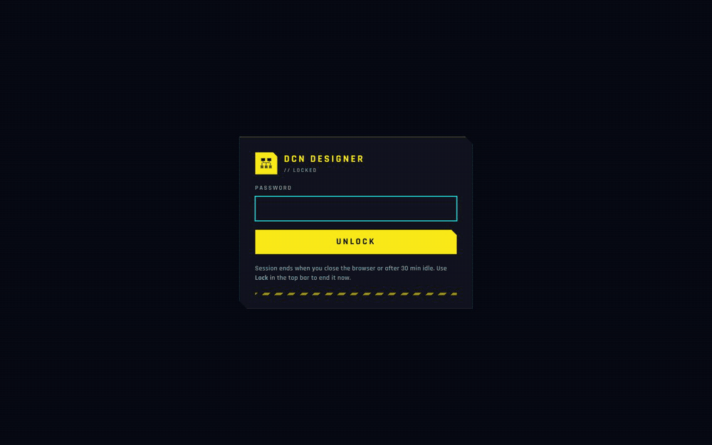

# DCN Designer

A Cisco data-center spine-leaf design tool. Enter the requirements, let the solver size
spines, leaves, uplinks, optics and racks, then walk the result as an interactive topology
and export a PDF report and a native Visio drawing. Runs as a desktop app (Electron) or
self-hosted in a browser.



## What it does

- **Requirements → design.** Per-tier endpoint counts or switch counts, target
  oversubscription, uplink auto-pick, breakout scenarios, ACI Multi-Pod candidates with IPN
  routers. Thirteen hard rules carried over from the original spreadsheet calculator.
- **Rack View.** 44U racks, U-slot placement, PDU budget, per-device labels (these become
  the hostnames shown on the topology).
- **Cable Links.** Port-to-port wiring seeded by the solver, editable, CSV import/export.
- **Topology.** Nexus-Dashboard-style hierarchy — fabric → Spines/Leaves stacks → every
  switch — with double-click drill-down, free drag at every level and per-level snap-back,
  aggregated or per-cable links, attribute filter, legend, detail pane. Spines, leaves and
  DPU smart switches each get their own glyph; devices without a hostname show a nickname of
  the model (`smart-sw-leaf12`, `gx2a-spine1`).
- **Summary + PDF.** Counts, BOM totals (switches, optics, cables with tray lengths),
  validation status, and a printable report whose Topology page is the Topology tab's device
  level, tile for tile, with real stencil front panels.
- **Visio export.** A native, editable `.vsdx` of the expanded topology — every switch at its
  on-screen position, every link, port labels — drawn with official Cisco stencil masters
  (extracted once into the workspace, see DEPLOY.md), a product photo, or a generated
  schematic front panel; every substitution is listed in the Export tab.
- **vPC leaf pairs.** Fabric mode (NX-OS classic, VXLAN EVPN, ACI) decides whether pairs get a
  peer-link and a port-channel; the solver pairs leaves, reserves the peer-link ports (smart
  switches stay on their 400G ports) and reduces spine uplinks with a warning when it must.
  Peer-links are seeded as their own cable kind — red on the Topology tab, in the PDF and in
  Visio, own rows in the cable BOM; ACI pairs show a bracket instead. "Show servers" adds one
  server symbol per leaf or per pair (model + NIC speed, one line per NIC) that both exports
  honour.
- **Library.** Switch, server, optics and IPN router catalogues in YAML; Cisco TMG optics CSV
  importer.

## Look

The UI is the **Night City** theme: signal yellow on near-black, cyan links, chamfered
panels, Rajdhani type. Light mode is the inverse yellow menu. Press `t` to toggle, `?` for
all shortcuts.

## Run it

```bash
npm ci

# desktop (Electron)
npm run dev

# self-hosted web target (server + browser bundle)
npm run web                 # builds the bundle and serves on :8788
DCN_AUTH_PASSWORD=… npm run start:web   # with the login page enabled
```

Tests, typecheck and the Docker/NAS deployment (including the Tailscale Funnel setup and
the login-session settings) are described in [DEPLOY.md](DEPLOY.md).

```bash
npm test          # vitest — domain solver, renderer libs, server sessions
npm run typecheck
```

## Layout of the repo

```
src/domain/        pure-TS solver (spines, breakout, multi-pod, racks, optics BOM)
src/renderer/      React 19 + Tailwind 4 UI (views/, lib/, schemas/, styles/)
src/server/        self-hosted HTTP server, login sessions, workspace API
src/main, preload/ Electron shell
seed/              starter library (switches, servers, IPN routers, breakout pairs)
docs/              demo media
```

Design decisions, the phase history and the session log live in
[PROJECT_PLAN.md](PROJECT_PLAN.md); gotchas and deferred ideas in [JOURNAL.md](JOURNAL.md).
Workspaces (customer projects and the live library) are never committed.
